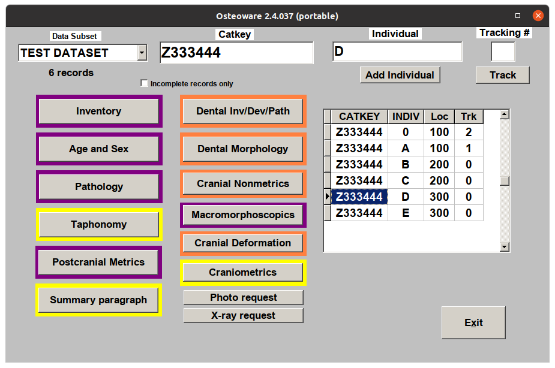
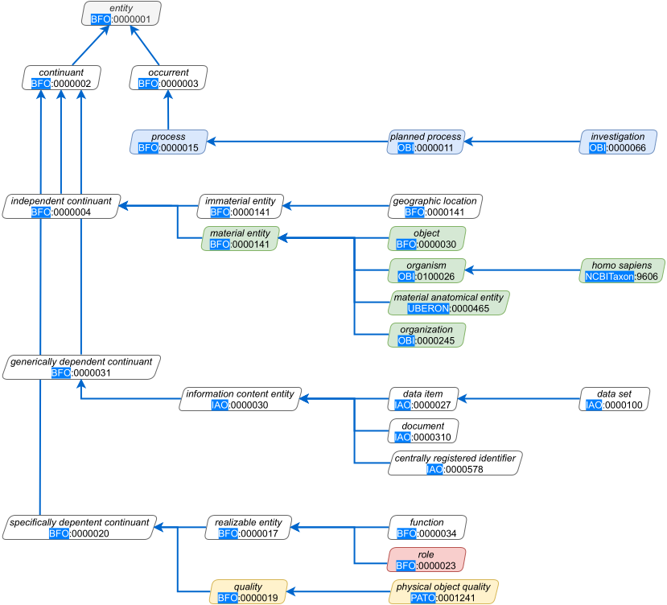

.. RDFBones-O documentation master file, created by
   sphinx-quickstart on Wed Apr 28 16:14:55 2021.
   You can adapt this file completely to your liking, but it should at least
   contain the root `toctree` directive.

Documentation of RDFBones and AnthroGraph
======================================

`RDFBones`_ is the core ontology of AnthroGraph, a software application supporting osteological research in biological anthropology
.. _RDFBones: https://github.com/RDFBones/RDFBones-O

.. toctree::
   :maxdepth: 2
   :hidden:
   :caption: Introduction

   /intro/section 1
   /intro/section 2
   /intro/section 2

Osteological Research in Biological Anthropology
================================================

.. _fact:Osteology_is_complex:

General Issues
--------------

The human skeleton consists of a multitude of skeletal structures that
provide different kinds of information about human physiology and life
histories ([Cox2000]_, [Katzenberg2008]_ ). Both the evidence and the
questions it is employed to address are heterogeneous and lead to a wide
range of methodological approaches, all with their specific limitations
and error margins. To obtain a thorough understanding, it is often
necessary to combine diverse information. Researchers are constantly
trying to apply new methods in order to complement life history
information gained from skeletal remains
(:raw-latex:`\citealt[12]{Mays2018}`).

[fact:Documentation_of_all_processes_needed]As a consequence,
osteological research data are complex and may result from discussion,
i. e. conclusions based on diverse evidence and resulting from multiple
lines of reasoning. This necessitates documentation of the entire
research process from data collection through analysis to reporting
(:raw-latex:`\citealt[340]{Stodder2012}`). This is especially helpful
for studies that combine results from several independent
investigations.

Specific challenges to documentation are
\_[fact:Structured_cause_of_action_is_essential]anecdotal recording
procedures, [fact:terminology-development-is-a-challenge]the development
of clear descriptive terminology and the coding of visual illustrations
used to report results (:raw-latex:`\citealt[340]{Stodder2012}`).
Anecdotal recording, here, refers to the occasional description of
evidence when it occurs as opposed to systematic analysis of a body of
material for a certain condition.

[fact:long-term_archiving_of_research_data_is_required]Thorough
documentation is necessary not only to make research data transparent
but also to account for skeletal remains often being unique information
carriers. They might not be available for re-evaluation due to reasons
including restitution or reburial or material being damaged or lost
during curation or research. As a consequence, research data are
potentially irretrievable (:raw-latex:`\citealt[339]{Stodder2012}`;
:raw-latex:`\citealt{Turner2019}`) and dealing with data coded according
to previous research strategies is often necessary.
[fact:Tracking_of_material_deterioration_is_needed]On the other hand,
repeated observations on the same material may trace its deterioration
over time.

Data standards might develop along scientific progress (see
:raw-latex:`\citealt[341--344]{Stodder2012}`, for dental caries as an
example, :raw-latex:`\citealt[67]{Grauer2008}`, for the example of
diagnostic criteria for degenerative joint disease and
:raw-latex:`\citealt[111]{Ortner2003a}`, for developments in disease
classification), producing differently coded data. Re-use of data may
include pooling of data coded according to different standards or
different versions of standard.

Settings of Osteological Research
---------------------------------

Human remains are kept and cared for in museums, universities,
government agencies, archaeological units and contract firms and other
such institutions as libraries and archives. These institutions can form
specific work groups for third-party-funded research projects.
Infrastructures can be developed in all of these settings, bound by
their specific missions, management standards and available resources
(:raw-latex:`\citealt[54]{Giesen2013a}`;
:raw-latex:`\citealt[627]{Roberts2010}`). Further framework conditions
are legal and ethical regulations (:raw-latex:`\citealt{Ahrndt2013}`;
:raw-latex:`\citealt[66]{Prevedorou2019}`;
:raw-latex:`\citealt{Viebig2003}`).

Research on skeletal remains is mostly conducted by national and
international researchers from universities and other institutions and
undergraduate, Masters and PhD students collecting data for their theses
(:raw-latex:`\citealt[627]{Roberts2010}`).

[fact:Osteology_is_under-funded]Osteological research is commonly
restricted by various infrastructural restraints, e. g. the
unwillingness of institutions to sustain curation of bioarchaeological
material and lack of research funding, often creating a long time-gap
between excavation and analysis (see
:raw-latex:`\citealt[61]{Prevedorou2019}`, for an example of research
conditions in Greece).

[fact:Osteology_relies_on_contextual_data]Osteologists commonly
investigate skeletal material that was recovered by others and,
therefore, rely on contextual information provided by excavators or
crime scene specialists (:raw-latex:`\citealt[62]{Prevedorou2019}`).

Of special interest are osteological reference collections of
individuals for whom demographic parameters and sometimes life history
information are known. Such material is essential for the development
and testing of osteological methods but also for research in historical
anthropology (:raw-latex:`\citealt{Eliopoulos2007}`;
:raw-latex:`\citealt{Nikita2020}`). Reference collections, typically,
are often re-examined, used in training of researchers and have various
research procedures applied to them. Documentation and digitisation of
the material and research procedures across investigations is,
therefore, required and a current requirement
(:raw-latex:`\citealt{Nikita2020}`).

Research Strategies
-------------------

Osteological research projects vary considerably in type and scope so
that requirements for data standards and software applications are
diverse (:raw-latex:`\citealt[347]{Stodder2012}`). A universal software
trying to accommodate all these requirements will always have to make
extensive compromises between different research strategies and
custom-made applications will always be better in serving the specific
needs of a particular project.

Different research traditions have emerged in different geographical
regions (:raw-latex:`\citealt[476/477]{Robb2000}`).

Osteological research strikes a balance between different considerations
like the research questions, required amount of detail in data
collection and available resources. These decisions should be formulated
in a research design at the onset of a project in order to avoid waste
of resources and unnecessary repetition of observations (see
:raw-latex:`\citealt[479/480]{Robb2000}` for a list of possible
considerations).

Research design describes how meaning can be ascribed to data patterns
and this process is often more important than data collection and
analysis (:raw-latex:`\citealt[487]{Robb2000}`).

Some osteological research projects might aspire to documenting the
entire range of information provided by a series of skeletal individuals
while others target specific conditions on particular skeletal elements
(:raw-latex:`\citealt[344]{Stodder2012}`). This implies different
workflows during analysis. For example, holistic projects require an
overview which analyses are concluded or remain to be conducted at any
given time of the project duration.

Data analysis is underdeveloped in osteological research and most
methodological contributions do not get past data collection
(:raw-latex:`\citealt[475]{Robb2000}`).

Internationally standardised observation and measurement techniques are
deployed differently in various research contexts while, actually, the
intended analysis should determine data collection
(:raw-latex:`\citealt[477]{Robb2000}`).

Stating individual cases in osteology commonly involves some
argumentation. Therefore, careful and thorough description is essential
to record the chains of reasoning that lead individual researchers to
establish a certain fact. For this reason, osteological research is in
danger of getting lost in vast amounts of detailed information that is
specific to individual skeletons while the relevant research questions
that this evidence should help to answer become forgotten
(:raw-latex:`\citealt[327/328]{Ortner2009}`). Osteological research
needs to establish increasing degrees of abstraction and each
abstraction layer requires good documentation on a more detailed level
in order to be credible. As a consequence, osteological research data
need to be rich in detail and powerful in abstraction.

In certain contexts, data collection can be tuned to variable degrees of
specificity, e. g. in palaeopathology
(:raw-latex:`\citealt[112]{Ortner2003a}`;
:raw-latex:`\citealt[333]{Ortner2009}`). It is helpful if these degrees
can be related to each other so that datasets can be merged on the level
of most general statements. As a consequence, detailed interpretations
should be embedded in a diagnostic hierarchy.

Osteological analyses work on different scales, ranging from individual
features (e. g. description of pathological cases), skeletal elements
(e. g. in methodological studies), skeletal individuals (e. g.
assessment of health status) to skeletal populations (e. g. in
epidemiology). Research commonly changes between these levels and
research data, databases and software needs support work with all of
them (:raw-latex:`\citealt[478]{Robb2000}`;
:raw-latex:`\citealt[346]{Stodder2012}`).

Description and interpretation of skeletal conditions needs to be
separated in order to allow for differential diagnosis, differing
interpretations and progress in scientific interpretation. This
separation, however, is often a challenge
(:raw-latex:`\citealt[68/69]{Grauer2008}`).

Osteological research involves a lot of preparation, e. g. in
reconstructing fragmented material and laying out skeletons in
anatomical order. As a consequence, osteologists tend to accomplish
several analytical steps in one go.
:raw-latex:`\citet[5, 108]{Buikstra1994}`, for instance, suggest to
conduct palaeopathological observations while compiling the skeletal
inventory or at least use the inventory process to identify potential
cases for later investigation. This approach, however, potentially
compromises data integrity as the presence or absence of a certain
pathological condition should be investigated with uniform determination
on all skeletal elements. So procedural phases should be understood as
separate steps in concluding an analysis and performed one after the
other.

:raw-latex:`\citet[66/67, Table 4.1]{Grauer2008}` observes two distinct
environments of osteological data collection: hypothesis- or
problem-driven research in academia on the one hand and thorough
skeletal documentation in contract scenarios on the other. If research
data are to become a sustainable resource, however, all data need to be
prone to re-purposing during data recycling.

The application of invasive methods in osteological research is
increasing (:raw-latex:`\citealt[628]{Roberts2010}`). Probing and the
resulting damage to the material need to be well documented as they
might affect subsequent investigations.

Research on osteological collections is a reiterative process where
studies answer questions that were raised in former investigations
(:raw-latex:`\citealt[629]{Roberts2010}`). Information on which studies
support or contradict either each other or hypotheses formulated during
this interchange is of scientific interest.

Quantification of and control for interobserver bias is a key issue in
the reuse of data, especially in osteology
(:raw-latex:`\citealt[347/348]{Stodder2012}`).

As with any other archaeological material, the heterogenous degrees of
preservation of prehistoric human remains render osteological
information of incoherent quality. These uncertainties pose a specific
problem for data standardisation (:raw-latex:`\citealt[338]{Menk1979}`).

Data sharing and reuse should be considered in the early stages of an
investigation and guide all subsequent steps of analysis
(:raw-latex:`\citealt[1]{Elton2020}`).

For open data to be useful, they must be intelligible without reference
to the originator (:raw-latex:`\citealt[1]{Elton2020}`).

Given the vast amounts of structured data that have already been
compiled by biological anthropologists, an important task is to release
them as proper resources to be shared and appropriated to new types of
studies. This will consume time and money
(:raw-latex:`\citealt[1]{Elton2020}`).

Re-use of research data inevitably will unveil errors in the data
themselves and omissions in their documentation. Corrections to these
shortcomings should be collected by data maintainers as part of
regulated data curation (:raw-latex:`\citealt[1]{Elton2020}`).

Digital Tools
-------------

Most osteologists produce structured research data employing relational
databases and, most commonly, spreadsheet applications
(:raw-latex:`\citealt[11]{Papageorgopoulou2013}`;
:raw-latex:`\citealt[482]{Robb2000}`).

:raw-latex:`\citet[335/336]{Menk1979}` shortly outlines the requirements
of a data management system in the face of complex information. He
stresses the importance to ‘protect users from this complexity’ and to
prevent them from committing ambiguous data entries.

Skeletal Inventory[sec:Skeletal-Inventory]
------------------------------------------

Skeletal data are typically fragmented and incomplete. Assessing
material preservation is necessary for comparisons between
differentially preserved assemblages by quantifying which observations
are possible and which are not (:raw-latex:`\citealt[5]{Buikstra1994}`;
:raw-latex:`\citealt[479]{Robb2000}`).

Skeletal inventories is among the core problems in documenting
osteological research (:raw-latex:`\citealt[62/63]{Grauer2008}`;
:raw-latex:`\citealt[340]{Stodder2012}`). They record two aspects of the
availability of material (:raw-latex:`\citealt[6]{Cooper2013}`):

-  representation

   , i. e. quantitative information on how much of the material is
   present

-  preservation

   , i. e. qualitative information about the condition of the material

With assessments of material representation it is necessary to
distinguish between ’present and complete’, ’partially present’, ’not
present’ (’zero’) and ’information not available’ (NULL,
:raw-latex:`\citealt[345]{Stodder2012}`).

Given limited material preservation or pathological deformation, it is
not always possible to identify skeletal elements exactly or determine
whether they come from the right or left side of the body. Such elements
still need to be addressed in skeletal inventories
(:raw-latex:`\citealt[345]{Stodder2012}`).

Skeletal human remains are recovered from different deposition contexts,
each posing different requirements for skeletal inventory
(:raw-latex:`\citealt[5]{Buikstra1994}`):

-  relatively complete skeletons, i. e. sets of skeletal remains for
   which association with a specific skeleton is certain or very likely

-  commingled remains

-  isolated bones

The purpose of skeletal inventories is to render the skeletal material
accessible for investigation. This can involve provision of photographs
and/or radiographs or scans for all available elements as suggested by
:raw-latex:`\citet[6]{Buikstra1994}`.

Skeletal inventory schemes may portion skeletal elements in various
amounts of partitions in order to describe representation and
preservation of skeletal material more specifically. Investigation of
certain sites on the bone where diagnostic features to be investigated
are located can be of particular importance. Therefore, skeletal
inventories should define precisely the regions that are of interest in
a given research context and explicitly collect information for
them.[fact:skeletal-inventories-require-ROIs]

At the Arizona State Museum in Tucson (Arizona, USA), a specialised
software was developed under the name ‘Bones’ that helps to compile and
visualise skeletal inventories. The main purpose of this effort was to
produce inventory charts to be attached to archival boxes in order to
minimise handling of the skeletal remains (see inset by Jennifer Riddle
and Vicki Cassman in :raw-latex:`\citealt[159]{Morris2006}`).

Material Selection for Specific Studies
---------------------------------------

At an early stage in skeletal analysis, there should be a moment of
consideration which lines of inquiry are purposeful and feasible in a
given situation. This might entail assessing the applicability of
analytical techniques or excluding material from analysis based on poor
preservation (:raw-latex:`\citealt[64]{Grauer2008}`). Negative decisions
should also be recorded together with the arguments that were evaluated.
Exclusion of individuals from analysis, for example, has a significant
effect on quantitative results and should, therefore, be properly
documented.

A basis for osteological investigations is to determine if the material
to be investigated qualifies for observations, either in terms of
completeness and preservation (cf. skeletal inventories,
section \ `[sec:Skeletal-Inventory] <#sec:Skeletal-Inventory>`__) or any
other quality required for the respective type of analysis
(:raw-latex:`\citealt[345]{Stodder2012}`).

Location of Observed Features
-----------------------------

Exact localisation of features observed on skeletal elements is
essential, both for data analysis and for eventual re-evaluation of
observations on the original material
(:raw-latex:`\citealt[62]{Grauer2008}`;
:raw-latex:`\citealt[346]{Stodder2012}`).

Contextual Data
---------------

Research in biological anthropology is often conducted in
interdisciplinary settings. A pool of common information is a core
requirement of such projects (:raw-latex:`\citealt[331]{Menk1979}`).

What contextual (i. e. non-osteological) information is necessary to
answer a particular research question should be part of any osteological
research design (:raw-latex:`\citealt[479]{Robb2000}`).

Integration of osteological research with neighbouring disciplines is
becoming increasingly important (see
:raw-latex:`\citealt[349]{Stodder2012}`, for the necessity of
bioarchaeologists to integrate their results with other archaeological
data and :raw-latex:`\citealt[65]{Grauer2008}`, for examples of
palaeopathological research being paired with other disciplines).

Materials
=========

Skeletal Material
-----------------

Associated Documents
--------------------

The term ’associated documents’ refers to all records directly or
indirectly related to skeletal material
(:raw-latex:`\citealt[53]{Giesen2013a}`). This includes reports and
other written records, drawings, photographs, x-ray images, publication
drafts and published work. These materials can be incorporated in
information systems in digitised form, genuinely digital material
includes digital scans, 3D models and video.

Associated records might also refer to the keeping and curation of
skeletal material, e. g. in the form of acquisition, accession and
de-accession records, repatriation/reburial requests and documentation,
consultation documents, location/storage information, condition
assessments, association with other skeletal objects, conservation
treatment records, pest control records, access and use logs.

Conservation and appropriate contextualisation of such resources
increases the value of research collections and the research data
produced from them.

Existing Osteological Data Standards
====================================

Data Collection Procedures for Forensic Skeletal Material
---------------------------------------------------------

The ‘Data Collection Procedures for Forensic Skeletal Material’ (DCP)
describe methods for age-at-death assessment and osteometry. It
constitutes the codebook for the Forensic Data Bank (FDB) at the
University of Tennessee, Knoxville, which also serves as reference data
for the software application ‘Fordisc’
(:raw-latex:`\citealt{Jantz2017}`; :raw-latex:`\citealt{Ousley2013}`).

The first version appeared in 1986, the third edition in 1994. The
current version (:raw-latex:`\citealt{Langley2016}`) constitutes a major
revision and is, therefore, referred to as ‘DCP 2.0’
(:raw-latex:`\citealt[7]{Langley2016}`).

The establishment of DCP 2.0 included a thorough assessment of all data
items for reliability and reproducibility
(:raw-latex:`\citealt[7]{Langley2016}`). Inter-observer errors resulting
from this investigation are included as an appendix.

Existing Osteological Database Applications
===========================================

Osteoware
---------

Osteoware is a software for documenting osteological investigations. It
implements the *Standards for Data Collection from Human Skeletal
Remains* (:raw-latex:`\citealt{Buikstra1994}`) and was developed at the
Repatriation Osteology Lab of the Smithsonian Institution (Washington,
USA; :raw-latex:`\citealt[1]{Wilczak2011}`) since 1991. Osteoware is
distributed as a desktop application for the Windows operating system
but can be used as a client software to feed an online database. Queries
on the data collected with Osteoware require a separate proprietary
software (Advantage Data Architect by Sybase). This software is also
needed to set up data subsets (e. g. representing material from the same
site) and issue catalogue numbers within these subsets (referred to as
’Catkeys’ in Osteoware, :raw-latex:`\citealt[4]{Wilczak2011}`).

   Main screen of the Osteoware software, version 2.4.037.

Upon startup, Osteoware displays its home screen, featuring an overview
of available data subsets and Catkeys along eleven buttons leading to
data entry forms dedicated to specific types of information, referred to
as modules. The button frames take on different colours, depending on
their investigation status for the current entry. Frame colours change
automatically, reflecting the current completeness of the underlying
table entries, but can also be changed manually. The main screen also
provides the options to issue photo and x-ray request to be processed in
specialised laboratory units.

Inventory Module
~~~~~~~~~~~~~~~~

Osteoware Catkeys can represent both individual skeletons and commingled
remains. For individual skeletons, users can use the inventory module
right away which is designed to take information about only one
skeleton. For commingled remains, there are two possible documentation
strategies: either the human remains subsumed under the Catkey are
subdivided and associated to separate individual skeletons or the Catkey
is understood to represent an assemblage of unrelated skeletal elements.
The latter case, again, offers two distinct courses of procedure. A
special ’commingled inventory’ can be made, recording for each skeletal
elements how many instances of this type are contained in the assemblage
represented by the Catkey. Alternatively, individual bones can be
registered in the database and more detailed information can be
collected for each of them.

Defining several skeletons for a Catkey makes sense in situations where
a bone assemblage is expected to represent a limited number of
individuals, e. g. with multiple burials. New individuals can be issued
on the main screen and are represented by capital letters in the INDIV
column of the overview table there. So one Catkey can be represented by
several entry IDs in Osteoware, each representing one individual
skeleton (:raw-latex:`\citealt[13]{Wilczak2011}`). All documentation
routines, including the skeletal inventory, can be performed separately
for each individual skeleton. It is not possible to define skeletons
represented by material from several Catkeys. In order to add elements
from a different Catkey to a skeleton, the respective material needs to
be reassociated with a different Catkey
(:raw-latex:`\citealt[6]{Wilczak2011}`). Such reassociations are
documented under a dedicated accession number at the Smithsonian
Institution (:raw-latex:`\citealt[13]{Wilczak2011}`).

The RDFBones Standard
=====================

RDFBones is a digital standard for research data from osteological
analyses in Biological Anthropology (:raw-latex:`\citealt{Engel2019}`).
It is designed to deal with the high diversity of contents and methods
in this field (cf. page  in ) and to pool information from disparate
existing databases.

Ontologies on which RDFBones is Based
-------------------------------------

RDFBones is mostly composed of elements borrowed from other ontologies.
In order to maintain compatibility with these, RDFBones adheres to their
logics as much as possible.

This introduction refers to RDFBones versions 0.2 and later.

Ontology for Biomedical Investigations[subsec:Ontologies-OBI]
~~~~~~~~~~~~~~~~~~~~~~~~~~~~~~~~~~~~~~~~~~~~~~~~~~~~~~~~~~~~~

The Ontology for Biomedical Investigations (OBI) models biological
research. The OBI offers standards for the representation of samples,
assays, and data analysis methods used in biomedical investigations.

The intention of the model is to standardise features that the various
scientific communities active in this area have in common, since these
communities tend to develop idiosyncratic standards when operating
individually. These individual standards are then not compatible,
despite similarities in methodology that would otherwise have allowed
for a straightforward cross-disciplinary analysis. To ensure
interoperability between different database systems, the methodology
must be described in unambiguous terms across all participating
disciplines (:raw-latex:`\citealt{Bandrowski2016}`). The OBI is capable
of representing all phases of the experimental process. This includes
all entities involved in preperation, execution, and interpretation of a
process, such as specimens and instruments used, data collected, and
analyses performed, and beyond that also representing roles and
functions in investigations (:raw-latex:`\citealt{Brinkman2010}`). The
OBO Foundry , of which OBI is a member since 2013, is a diverse and
multinational group of life scientists. The group arose from the OBO
project initiated in 2001, which was the initial attempt at
standardizing data collection in certain life sciences. OBI itself has
also evolved out of previous similar ontologies produced by scientists
of the OBO project (:raw-latex:`\citealt{Smith2007}`). The group of
scientists collaborating on OBI stemmed from 19 different biomedical
communities from various nations when OBI was first added to the OBO
Foundry, and the current group continues with regular meetings to
discuss progress on the ontology  [1]_. Though these meetings are
primarily for those deeply involved with the project, the community and
forum discussions are openly accessible, and anyone wishing to join the
initiative is encouraged to do so (:raw-latex:`\citealt{Smith2007}`).
The OBO Foundry requires all member-ontologies to define a term only
once among them, a practice called orthogonality [modeling biomedical
experimental processes with obi], though this ideal has proven difficult
to implement across all OBO Foundry ontologies [how orthogonal are the
obo foundry ontologies]. As a member of the OBO Foundry, OBI also uses a
common set of relations from the Relations Ontology, and uses the Basic
Formal Ontology as its upper-level framework. This aids interoperability
with other ontologies and supports automated reasoning

The subset implemented in RDFBones represents a slimmed version of the
OBI, retaining the general outline of the OBO framework and central OBI
elements. Though there is a focus on genetics and other molecular
methods in the OBI, the general sequence of operations in investigations
provides a suitable framework for osteological work. This provides the
backbone onto which all other classes and properties in RDFBones are
modelled ().

The logical backbone of the OBI is provided by the BFO. All concepts are
subclasses of class ‘entitiy’. A general distinction is made between
‘continuants’, entities that are relatively permanent, and ‘occurrents’
with a limited duration. The occurrents relevant for RDFBones are all
‘processes’ and most of them are ‘planned processes’, meaning their
execution is previously devised. The central subclass of class ‘planned
process’ in the OBI is, of course, the class ‘investigation’.

Continuants, according to OBO, are either dependent or independent.
‘Independent continuants’ are natural entities existing out of
themselves. They can be material or immaterial. Subclasses of ‘material
entity’ that are relevant to RDFBones include ‘object’, ‘organism’,
‘material anatomical entity’ and ‘organization’. A subclass of
‘organism’ is ‘homo sapiens’ representing all human bodies and beings.
The OBI does not make a distinction between ‘homo sapiens’ and the
concept of a person. Therefore, individuals of the class ‘homo sapiens’
occur both as specimen and as executing researchers, principal
investigators, etc. There are several subclasses of class ‘homo sapiens’
describing various groups of agents in scientific investigations.

Dependent continuants are further classified into two groups, depending
whether they depend on a specific entity or not. ‘Specifically dependent
continuants’ can be ‘qualities’ of certain objects like material, colour
etc. Another type of ‘specifically dependent continuants’ is ‘realizable
entities’. These can describe ’functions’ of objects, e. g. if a ruler
is used as a measuring device or as a straight guide, or ’roles’ that
individuals and objects can fulfill in the course of an investigation,
e. g. as experimental subect or as analyst. ’Generically dependent
objects’ are mostly individuals of the subclasses of class ’information
content entity’. This comprises all kinds of information about other
entities. Especially relevant for RDFBones are the classes ’data item’
and ’data set’, the latter being a collection of instances of the
former. Also, the concept of ’centrally registered identifiers’ is used
in various contexts, e. g. to describe individual skeletons in a series,
pseudonyms in a blinded study or archaeological features from which
skeletal material derives.

OBI modelling of Investigations[subsec:OBI-Investigations]
^^^^^^^^^^^^^^^^^^^^^^^^^^^^^^^^^^^^^^^^^^^^^^^^^^^^^^^^^^

.. figure:: ../docs/gfx/OBI-Investigations.pdf
   :alt: [fig:OBI_investigations]Scientific investigations as modelled
   by the OBI. Simplified version of a diagram provided by the OBI
   workgroup
   (http://obi-ontology.org/assets/images/docs/core-classes/obi_investigation.png;
   last accessed on 3 September 2020).
   :width: 100.0%

   [fig:OBI_investigations]Scientific investigations as modelled by the
   OBI. Simplified version of a diagram provided by the OBI workgroup
   (http://obi-ontology.org/assets/images/docs/core-classes/obi_investigation.png;
   last accessed on 3 September 2020).

While the OBI models various structures related to scientific research,
a central element is the process chain of investigations (). There are
three major phases: ’planning’, ’study design execution’ and ’drawing a
conclusion based on data’. An output of the planning stage is a ’study
design’ which then is executed in the second stage where data are
produced which are interpreted in the third. The OBI requires users to
fill in elements that are represented by ‘anon’ placeholders in . First,
a more specific subclass of planning needs to be defined, describing the
process that leads to the establishment of a study design. Also, the
study design execution does not realise the study design directly but
some direction concretising the study design in respect of the
investigation to be carried out. This mechanism allows study designs to
be defined on a general level for use in several investigations. Each
investigation interprets the study design in terms of its specific
context, e. g. the material to be used or the facilities at disposition.
Several classes (not represented in ) are related to class ‘study
design’ through the ‘has part’ property, providing specifications for
many of the processes and input/output elements subsumed under ‘study
design execution’.

‘Study design execution’ consists of a sequence of processes that have
input and output objects in a way that the output of the previous is the
input to the following. The ’specimen collection process’ selects human
remains from a collection of material for investigation. The selected
material is then referred to as ’specimens’. Specimens can be further
processed, e. g. if samples are taken or thin sections produced.
Specimens are subjected to a number of assays, e. g. structured
observations, measurements or analyses. The resulting data items are
understood as measurement data. Data processing can also be part of
study design execution, subsuming processes like aggregation of multiple
data items, calculations and statistical analyses.

Investigations close with one or several conclusions. Conclusions
contain specifications of the data items on which they are based. The
OBI also offers conepts for modelling the publication of resulting data
items and conclusions in publications (these, however, are not
illustrated in ).

OBI Modelling of Unique Identifiers[subsec:OBI-CRIDs]
^^^^^^^^^^^^^^^^^^^^^^^^^^^^^^^^^^^^^^^^^^^^^^^^^^^^^

.. figure:: ../docs/gfx/OBI-CRIDs.pdf
   :alt: Unique identifiers as modelled by the OBI.
   :width: 100.0%

   Unique identifiers as modelled by the OBI.

Another concept that RDFBones adopts from the OBI is the modelling of
series of unique identifiers. In osteological research, these appear in
various contexts, e. g. denoting individual skeletons, stratigraphical
units from excavations, shelfmarks in museums and archives or sample
identifiers.

The central concept in relation to unique identifiers is the class
‘centrally registered identifier’, abbreviated as CRID. CRIDs are
composed of at least two parts, a ‘centrally registered identifier
symbol’, i. e. the sequence of letters and numbers written on labels or
boxes, and an additional piece of information that relates the CRID to a
series of identifiers, a ‘centrally registered identifier registry’ in
OBI terms. How this construct is to be implemented is exemplified in the
definition of class ‘centrally registered identifier symbol’:

   The sentence The article has Pubmed ID 12345. contains a CRID that
   has two parts: one part is the CRID symbol, which is ’12345’; the
   other part denotes the CRID registry, which is Pubmed.

The OBI offers two subclasses of class ‘planned process’ for modelling
interactions with CRIDs. Class ‘assigning a centrally registered
identifier’ describes the creation of new CRIDs while class ‘associating
information with a centrally registered identifier in its registry’
refers to adding information that is described by a CRID.

Both CRID and CRID symbol can be related to objects they denote through
the property ‘is about’, a concept inherited from class ‘information
content entity’. It is preferable to use the symbol for this connection
as this is the most specific part of the CRID.

CIDOC Conceptual Reference Model[subsec:Ontologies-CIDOC_CRM]
~~~~~~~~~~~~~~~~~~~~~~~~~~~~~~~~~~~~~~~~~~~~~~~~~~~~~~~~~~~~~

CIDOC CRM stands for the Comite Internatioal pour la Documentation
Conceptual Reference Model (CIDOC CRM). CIDOC provides the museum
community with advice on good practice and developments in museum
documentation  [2]_ . In order to become a member of CIDOC, one needs to
be a member of ICOM, the international council of museums. Membership of
ICOM is generelly reserved for anyone with a professional tie to the
museum field. ICOM is intended to provide a network for museum
professionals to communicate with the public and each other, and to
function as a forum for establishing ethical and professional standards
for the museum field (ICOM) [3]_. CIDOC forms a committee within ICOM,
and the CIDOC Conceptual Reference Model Special Interest Group within
CIDOC has been overseeing development of CIDOC CRM. In 2006 CIDOC CRM
became the official standard for the ontologies in museum curation as
ISO 21127:2006  [4]_. Work continues on the Model, the current standard
being ISO 21127:2014.

CIDOC CRM lends itself well for scientific investigation in
archaeological sciences. Typically, archaeology has suffered from
fragmented datasets and terminology systems. Effective cross-searching
is often limited or impossible due to differing semantics between
datasets, assuming they are made available at all
(:raw-latex:`\citealt{Binding2010}`). Some ontological instruments have
been employed over time, such as the Dublin Core Metadata Elements and
the Simple Knowledge Organization System (SKOS). However, often times
two closely related items may not find correllation via their metadata,
even when adhering to Dublin Core standards. Doerr notes that metadata
generally contains information pertaining to the object itself, and not
to events or broader contexts to which the item may relate; two items
cloesely tied to the same event may thus not be recognised as being
related to each other, such as a copy of the Yalta Agreement and a photo
taken of the allied leaders during the Yalta meeting
(:raw-latex:`\citealt{Doerr2003}`). In his seminal work on CIDOC CRM,
Doerr goes into great detail over the problems CIDOC CRM is intended to
alleviate. Cherny advocates the use of CIDOC CRM over other tools like
Dublin Core and SKOS, as these alternatives are not intended to
represent the full richness of cultural heritage data
(:raw-latex:`\citealt{Cherny2015}`). CIDOC CRM supports additional
semantic meaning beyond what was already recorded with the original
data, the lack of which would result in the previously described problem
of limited relatability of items. As Cherny also mentions, CIDOC CRM has
already found widespread global appeal, meaning that data integration is
easier for anyone that also uses this standard. An extended example of
this is noted by Dijkshoorn in the form of the Europeana Data Model,
which is used to deliver cultural heritage data to the data aggregator
Europeana, to which CIDOC CRM (among other alternatives) can be mapped
(:raw-latex:`\citealt{Dijkshoorn2018}`). The Europeana Data Model is
nowadays used by other aggregators,as well as institutions publishing
their own data.

Extensions of CIDOC CRM
^^^^^^^^^^^^^^^^^^^^^^^

Hiebel proposes CRMgeo, an extension of CIDOC CRM that provides a global
schema for documenting spatiotemporal properties
(:raw-latex:`\citealt{Hiebel2017}`). It is designed to comply to the
definitions and standards defined by the Open Geospatial Consortium in
GeoSPARQL. This allows CRMgeo to integrate CIDOC CRM and its data with
the spatiotemporal analyses offered by geoinformation systems.

Niccolucci proposes CRMas, an extension of CIDOC CRM using the already
existing extensions of CRMdig and CRMsci, which are also designed to
improve scientific documentation capabilities
(:raw-latex:`\citealt{Niccolucci2017}`). CRMas is intended as a
documentation tool for archaeological science that can record the wide
range of methods used in archaeological investigation. The focus is on
the part of the investigation process that occurs while producing the
results that can be used to perform an archaeological interpretation,
i.e. the observation or analysis of an archaeological find. Niccolucci
identifies the observation and analysis components as potential black
boxes with a variety of factors that must be documented. He further
defines an observation as an experiment that produces only analogic
information, and an analysis as an experiment that directly produces
numeric results, typically through the use of processing machinery. Both
cases require adequate documentation, as successful re-use of the data
by other scientists in future studies can not be guaranteed.

CIDOC CRM within RDFBones
^^^^^^^^^^^^^^^^^^^^^^^^^

Inclusion of the CIDOC CRM into RDFBones was motivated by the fact that
the ontology emerges from long-standing active development and is
implemented in several software projects, including the Museum of
London’s ResearchSpace [5]_ and Geovistory [6]_. RDFBones’ elements
leaned from the CIDOC CRM provide a basis for establishing compatibility
with such systems.

.. figure:: ../docs/gfx/RDFBones-CIDOC-CRM_Subset.pdf
   :alt: [fig:CIDOC-CRM_subset]Elements in the RDFBones subset of the
   CIDOC CRM.
   :width: 100.0%

   [fig:CIDOC-CRM_subset]Elements in the RDFBones subset of the CIDOC
   CRM.

shows the elements in the RDFBones subset of the CIDOC CRM. It
introduces the concept of collections (class cidoc:E78) which can be
composed of (property cidoc:P46) both biological objects (class
cidoc:E20), e. g. human remains, and man-made objects (class cidoc:E22),
e. g. accompanying finds or casts.

A central point made by CIDOC CRM’s definition of the class ‘collection’
is that they are curated by one or more instances of the class ‘actor’
(cidoc:E39). Actors can be either groups (class cidoc:E74), e. g.
scientific societies and institutions, or individual persons (class
cidoc:E39). These act on collections and their components via curation
activities (class cidoc:E87). This constructs allows to document the
history of a collection’s curation as a series of of events (curation
activities) that can be filtered by the actors and collections involved
in them.

.. figure:: ../docs/gfx/RDFBones-CIDOC-CRM_Subset-Classes-Continuants.pdf
   :alt: [fig:CIDOC-CRM_subset_continuants]Classes representing
   continuants in the RDFBones subset of the CIDOC CRM compared to
   classes in the OBI subset. Black lines indicate similar classes that
   are not necessarily exchangeable but whose definitions overlap
   considerably. Classes that do not appear in RDFBones are greyed out.
   :width: 100.0%

   [fig:CIDOC-CRM_subset_continuants]Classes representing continuants in
   the RDFBones subset of the CIDOC CRM compared to classes in the OBI
   subset. Black lines indicate similar classes that are not necessarily
   exchangeable but whose definitions overlap considerably. Classes that
   do not appear in RDFBones are greyed out.

Unlike classes in OBO ontologies, that are bound to have not more than
one direct superclass, classes in the CIDOC CRM canCIDOC CRM have
several of them (cf. ). As the OBI subset functions as the conceptual
backbone of RDFBones, integration of the CIDOC CRM subset involves
placing classes within the basic OBI structure while maintaining as much
of the modelling principles intended by the CIDOC CRM.

Both classes ‘man-made object’ and ‘biological object’ are subclasses of
‘physical object’ (class cidoc:E19), according to the CIDOC CRM. The
equivalent OBI class is ‘object’ (class bfo:0000030) as the definitions
show [7]_:

.. table:: comparing bfo-‘object’ and cidoc-‘physical object’
   :widths: auto

+----------------------------+-----------------------------------------+
| bfo:0000030, ‘object’      | cidoc:E19, ‘physical object’            |
+============================+=========================================+
| An object is a maximal     | This class comprises items of a         |
| causally unified material  | material nature that are units for      |
| entity.                    | documentation and have physical         |
|                            | boundaries that separate them           |
|                            | completely in an objective way from     |
|                            | other objects. [...]                    |
+----------------------------+-----------------------------------------+

As a consequence, the classes ‘man-made object’ and ‘biological object’
can be modelled as subclasses of class ‘object’ (bfo:0000030).
‘Collection’ (class cidoc:E78) does not meet the definition of ‘object’
but its being a subclass of ‘physical man-made thing’ (class cidoc:E24)
makes clear that it is to be understood not as a theoretical concept
unifying a certain number of physical objects but as a physical entity
itself. The most stringent anchor point in the OBI might be the class
‘material entity’ (bfo:0000040), an equivalent to the CIDOC CRM class
‘physical thing’ (cidoc:E18):

.. table:: comparing bfo-‘material entity’ and cidoc-‘physical thing’
   :widths: auto

   +---------------------------------+-------------------------------------+
   | bfo:0000040, ‘material entity’  | cidoc:E18, ‘physical thing’         |
   +=================================+=====================================+
   | An independent continuant that  | This class comprises all persistent |
   | is spatially extended whose     | physical items with a relatively    |
   | identity is independent of that | stable form, man-made or            |
   | of other entities and can be    | natural. [...]                      |
   | maintained through time.        |                                     |
   +---------------------------------+-------------------------------------+

There is no equivalent to the CIDOC CRM class ‘actor’ (cidoc:E39) in the
OBI where investigatior, specimen collectors or contact persons are all
modelled as subclasses of ‘homo sapiens’ (class ncbtaxon:9606), an
indirect subclass of ‘material entity’ (class bfo:0000040). The top
distinction of the CIDOC CRM, on the other hand, is between ‘things’
(class cidoc:E70) and ‘actors’ (class cidoc:E77). However, the class
‘person’ (cidoc:E39) is a subclass of both ‘actor’ and ‘biological
object’ (class cidoc:E20). So while ‘actor’ and its subclass ‘group’
(class cidoc:E74) are not necessarily interpreted as material entities,
‘person’ definitely can be seen as a material concept, though this is
not obligatory as specified by the class definition:

   Legendary figures that may have existed, such as Ulysses and King
   Arthur, fall into this class if the documentation refers to them as
   historical figures.

The CIDOC CRM class ‘legal body’ (cidoc:E40), subclass of ‘group’
(cidoc:E74) has the OBI class ‘organization’ (obi:0000245) as an
equivalent:

=========================================================================================================================================================================
=====================================================================================================================================================================================================================================================================================================================
obi:0000245, ‘organization’                                                                                                                                               cidoc:E40, ‘legal body’
=========================================================================================================================================================================
=====================================================================================================================================================================================================================================================================================================================
An entity that can bear roles, has members, and has a set of organization rules. Members of organizations are either organizations themselves or individual people. [...] This class comprises institutions or groups of people that have obtained a legal recognition as a group and can act collectively as agents. This means that they can perform actions, own property, create or destroy things and can be held collectively responsible for their actions like individual people. [...]
=========================================================================================================================================================================
=====================================================================================================================================================================================================================================================================================================================

The OBI models ‘organization’ as a direct subclass of ‘material entity’
(class bfo:0000040).

This review of concepts of agents in the CIDOC CRM as compared to
counterparts in the OBI shows that the OBI interprets all actors as
physical entities while the CIDOC CRM leaves some room for
differentiating between biological organisams and their social and legal
representations as persons or groups. Such a distinction would make
sense in RDFBones as it would help covering use cases aiming at
identifying human remains against a list of known persons (e. g. in
traffic accidents or mass graves). This would imply to model persons and
groups as specifically dependent continuants inhering in an organism or
a group of organisms. There are two strong arguments against such a
concept. First, ‘organization’ (class obi:0000245) being a subclass of
‘material entity’ (class bfo:0000040) shows that this would be clearly
against the logics of the OBI and, secondly, it would prevent actors
from taking on roles. As a consequence, all actors need to be modelled
as independent continuants.

.. figure:: ../docs/gfx/RDFBones-CIDOC-CRM_Subset-Classes-Occurrents.pdf
   :alt: [fig:CIDOC-CRM_subset_occurrents]Classes representing
   occurrents in the RDFBones subset of the CIDOC CRM compared to
   classes in the OBI subset. Black lines indicate similar classes that
   are not necessarily exchangeable but whose definitions overlap
   considerably. Classes that do not appear in RDFBones are greyed out.
   :width: 100.0%

   [fig:CIDOC-CRM_subset_occurrents]Classes representing occurrents in
   the RDFBones subset of the CIDOC CRM compared to classes in the OBI
   subset. Black lines indicate similar classes that are not necessarily
   exchangeable but whose definitions overlap considerably. Classes that
   do not appear in RDFBones are greyed out.

The only occurrent in the RDFBones subset of the CIDOC CRM is ‘curation
activity’ (class cidoc:E87). Its superclass ‘activity’ (class cidoc:E7)
is similar to the OBI class ‘planned process’ (obi:0000011):

=============================================================================================
===============================================================================================================================================================================
obi:0000011, ‘planned process’                                                                cidoc:E7, ‘activity’
=============================================================================================
===============================================================================================================================================================================
A processual entity that realizes a plan which is the concretization of a plan specification. This class comprises actions intentionally carried out by instances of E39 Actor that result in changes of state in the cultural, social, or physical systems documented. [...]
=============================================================================================
===============================================================================================================================================================================

As a consequence, ‘curation activity’ (class cidoc:E87) can be modelled
as a subclass of ‘planned process’ (obi:0000011).

.. figure:: ../docs/gfx/RDFBones-CIDOC-CRM_Subset-ClassIntegration.pdf
   :alt: [fig:CIDOC-CRM_subset_integration]Integration of the RDFBones
   subset of the CIDOC CRM with the OBI subset.
   :width: 100.0%

   [fig:CIDOC-CRM_subset_integration]Integration of the RDFBones subset
   of the CIDOC CRM with the OBI subset.

shows how the classes of the RDFBones subset of the CIDOC CRM are
integrated with the OBI subset as a consequence of the discussions
above.

Foundational Model of Anatomy[subsec:Ontologies-FMA]
~~~~~~~~~~~~~~~~~~~~~~~~~~~~~~~~~~~~~~~~~~~~~~~~~~~~

RDFBones uses the Foundational Model of Anatomy (FMA) to model skeletal
anatomy and to provide options for analysis in wider anatomical
contexts. The FMA is a purpose-built ontology for use in other
ontologies that require a well-structured model of anatomical concepts.
Though vast and in-depth simultaneously, it is also intended to be
generalisable and able to be filtered to suit a specific need
(:raw-latex:`\citealt{Rosse2003}`), as was done for AnthroGraph.

The FMA only refers to canonical anatomical concepts and does not by
itself harbour instantiated anatomy. This means that pathologies and
malformations, just as any specific instance of an anatomical part of an
actual human individual, are not included in the ontology’s entities.
The FMA is in fact only intended to be a foundation (hence the name) for
the representation of instantiated anatomy.

The ontogenesis of the human body is a central point of orientation when
it comes to organising the FMA: the most basic category, which contains
all individual material anatomical structures, ‘Anatomical Structure’,
is based on the concept of a physical entity which has an inherent
three-dimensional shape, which itself is “generated by a coordinated
expression of the organism’s own structural genes”. This
ontogenetics-based system is the first principle upon which the
representation in the FMA is built upon. The second principle is the
organisation into units. Units here refers to a structural element of
the whole, such as the classes ’Organ’ or ’Cell’, with the entity
representing the ’whole’ being the class ’Body’. This concept expands to
aggregates of these units, such as the classes ’Organ system’ and
’Anatomical cluster’, or to parts of units, such as the classes ’Body
part’ and ’Organ part’. The FMA also accommodates descriptors of
physical entities, like cavities and surfaces of organs, and more
abstract concepts such as terms, coordinates, and relationships between
entities. As relationships are a basic and important aspect of
anatomical representation, the FMA is intended to be more specific in
describing relationships than most structured vocabularies, which it
does through a diverse set of logical rules and inheritance patterns.

Generally, the most reasonable way to represent the body, human or
otherwise, is in part-whole relationships. These relationships however
differ quite often in their organisation between disciplines and
applications such that they end up conflicting each other; there are
many ways to define e.g. the concept of ‘upper arm’ - is the head of the
femur part of the arm, or part of the shoulder joint? Taking every
possible definition into consideration may reduce an anatomical ontology
to a sort of dictionary void of any relational information. The FMA
keeps the logical approach of part-whole relationships while attempting
to “accommodate various views and conventions while remaining consistent
and logical” (:raw-latex:`\citealt{MejinoJr2003}`).

A set of rules defines how part-whole relationships are applied in the
FMA. The rule of ’Dimensionality Consistency’ calls for distinction
between boundary and partonomy relationships. Part-whole axioms can only
be applied for entities that share the same dimensionality:

The statement {‘Right ventricle’ -has part- ‘Wall of right ventricle’}
is valid, as both subject and object are 3D.

The statement {‘Right ventricle’ -has part- ‘Surface of right
ventricle’} is not, as the subject is 3D and the object is 2D. This
relationship would instead have to be presented with the axiom:

{‘Right ventricle’ -bounded by- ‘Surface of right ventricle’}. The
predicate ’bounded by’ allows for a difference of one dimension.

The rule of ’Containment/Part Distinction’ likewise delimits ’contains’
and ’contained-in’ relationships. These two rules suffice within classes
such as ’Conceptual anatomical entity’ and ’Body substance’, but in the
class ’Anatomical structure’ more specifications are needed. These
specifications are set by the class itself so that they may be inherited
by the according subclasses (:raw-latex:`\citealt{MejinoJr2003}`).

Further important attributes for partonomy are the attributes
’constitutional part’ and ’regional part’. ’Constitutional part’
pertains to what is best described as larger, yet simpler-than-the-whole
structural compounds of an organ/anatomical structure. Partitions are
based on composition, not spatial factors. ’Regional part’ pertains to
spatial subdivisions. These subdivisions partition constitutional parts
which are in shared locations into sets. Subdivision of the body into
functional sysems is a common method in anatomy and clinical medicine.
However, the FMA defines the class ’Organ system’ in a structural
context and constrains the parts of such a system to organs and their
primary regional parts. ’Systemic part’ relations are used as a
secondary partition which can be displayed transitively in a partonomy
hierarchy, as can constitutional and regional parts.

RDFBones uses classes from the FMA to represent skeletal elements
featured in osteological investigations. Studies involving osteological
research data can make recourse to the rich semantic information of the
FMA in order to analyse skeletal elements within their anatomical
context.

.. figure:: ../docs/gfx/RDFBones-FMA_Subset-CentralClasses-Material Entities.pdf
   :alt: [fig:FMA_subset_material_entities]Classes in the RDFBones
   subset of the FMA representing material entities compared to classes
   in the OBI subset. Black lines indicate similar classes that are not
   necessarily exchangeable but whose definitions overlap considerably.
   Classes that do not appear in RDFBones are greyed out.
   :width: 100.0%

   [fig:FMA_subset_material_entities]Classes in the RDFBones subset of
   the FMA representing material entities compared to classes in the OBI
   subset. Black lines indicate similar classes that are not necessarily
   exchangeable but whose definitions overlap considerably. Classes that
   do not appear in RDFBones are greyed out.

|[fig:FMA_subset_immaterial_entities]Classes in the RDFBones subset of
the FMA representing immaterial entities compared to classes in the OBI
subset. Black lines indicate similar classes that are not necessarily
exchangeable but whose definitions overlap considerably. Classes that do
not appear in RDFBones are greyed out.|\ ‘

The subset implemented in RDFBones contains material () and immaterial
() anatomical entities. Material entities represent skeletons,
individual bone organs and teeth as well as their components. The FMA
class ‘material anatomical entity’ (fma:67165) has a direct counterpart
in the OBI, also labelled ‘material anatomical entity’ (uberon:0000465).
This provides the anchor point for material anatomical entities from the
FMA with the OBI backbone of RDFBones.

Immaterial entities represent bone surfaces and cavities as well as
tooth cavities. The FMA class ‘immaterial anatomical entity’ (fma:67112)
does not have a direct counterpart in the OBI. For integration with
RDFBones, its subclasses ‘anatomical boundary entity’ (fma:50705) and
’anatomical space’ (fma:5897) are modelled as direct subclasses of the
OBI class ‘immaterial entity’ (bfo:0000141). The FMA class ‘immaterial
anatomical entity’ is not adopted by RDFBones as the RDFBones class
‘anatomical region of interest’ (rdfbones:AnatomicalRegionOfInterest)
would be a subclass of ’immaterial anatomical entity’ in the FMA but is
modelled as a subclass of the OBI class ’site’ (bfo:0000029) in
RDFBones. ’Site’, however, does also subsume non-anatomical (e. g.
geographic) sites.

.. figure:: ../docs/gfx/RDFBones-FMA_Subset-Properties.pdf
   :alt: [fig:FMA_subset_properties]Properties in the RDFBones subset of
   the FMA compared to properties in the OBI subset. Black lines
   indicate equivalent properties. Properties that do not appear in
   RDFBones are greyed out.
   :width: 100.0%

   [fig:FMA_subset_properties]Properties in the RDFBones subset of the
   FMA compared to properties in the OBI subset. Black lines indicate
   equivalent properties. Properties that do not appear in RDFBones are
   greyed out.

The FMA subset contains a number of properties expressing different
kinds of partonomy (). The FMA properties ‘part’ (fma:part) and ‘part
of’ (fma:part_of) are equivalents of the corresponding properties ‘has
part’ (bfo:0000051) and ‘part of’ (bfo:0000050) in the OBI subset. To
integrate FMA properties into RDFBones, the former are replaced by the
latter.

Submodules of RDFBones
----------------------

The Collection Management Model
~~~~~~~~~~~~~~~~~~~~~~~~~~~~~~~

In biological anthropology, specimen are often not collected
specifically for certain investigations as it is the case in most areas
of biological research. Instead, human remains from pre(historic) or
forensic sites and clinical backgrounds are commonly archived and
provided for several investigations. Bodies of material that are kept in
one place by the same institution are referred to as ’collections’ in
RDFBones. Collections might represent material from a common source,
including historical collections that are curated as a closed entity.
Therefore, an institution may care for several collections. Examples for
collections include skeletal material from archaeological excavations in
a state that are collected in a state archive, an anatomical collection
sustained by a university institute or a private collectin left behind
by a 19th-century scholar. Collections might include objects other than
human remains, e. g. related archaeological finds or representations
like casts or pieces of documentation. Note that ’collection’, in this
context, always refers to a body of curated objects and never to the
institution or organisation by which it is kept.

The management of collections of human remains affects anthropological
research. For example, it is important to know where specific remains
are kept to obtain access for evaluation of previous research or
additional investigations. Also, material is lost to research in cases
where curators decide to sacrifice human remains for invasive analyses.
The documentation of curation activities with a bearing on
anthropological research are, therefore, within the scope of RDFBones.

Structure of the Collection Management Model
^^^^^^^^^^^^^^^^^^^^^^^^^^^^^^^^^^^^^^^^^^^^

.. figure:: ../docs/gfx/RDFBones-CollectionManagementModel.pdf
   :alt: Central elements of the collection management model.
   :width: 100.0%

   Central elements of the collection management model.

RDFBones uses the CIDOC CRM () to model mechanisms of collection
management.

Collections are represented by the class ‘collection’ (cidoc:E78) and
consist of (cidoc:P46, ’is composed of’) instances of class ’material
entity’ (BFO:0000040) or its subclasses, especially the following:

-  ’material anatomical entity’ (uberon:0000002) covering human remains

-  ’biological object’ (cidoc:E20) covering other organic specimen
   relating to nature or natural history

-  ’man-made object’ (cidoc:E22) covering artefacts

The latter two are subclasses of ’object’ (bfo:0000030).

Class ‘collection’ (cidoc:E78) is a subclass of class ‘physical thing’
(cidoc:E18) in the CIDOC CRM while the OBI () provides the example of
class ’collection of specimens’ (obi:0002076) which is a subclass of
class ’material entity’ (bfo:0000040). So both the CIDOC CRM and the OBI
interpret collections of physical entities as physical entities
themselves which are composed of the objects they contain and not as
immaterial entities denoting a series of phyiscal entities. This
understanding is also adopted by RDFBones.

Registering Skeletal Material For a Collection
^^^^^^^^^^^^^^^^^^^^^^^^^^^^^^^^^^^^^^^^^^^^^^

.. figure:: ../docs/gfx/RDFBones-MaterialRegistration.pdf
   :alt: Basic integration of human remains into the collection.
   :width: 100.0%

   Basic integration of human remains into the collection.

The Anatomical Model
~~~~~~~~~~~~~~~~~~~~

All human anatomy is modelled by the FMA (cf. ). RDFBones adds some
elements to make anatomical elements accessible for osteological methods
used in biological anthropology.

Anatomical Regions of Interest
^^^^^^^^^^^^^^^^^^^^^^^^^^^^^^

Different osteological methods require different parts of bones or
specific features on them to be available for investigation. Also,
skeletal inventories might record representation and preservation for
arbitrary sections of skeletal elements (cf. p. ). These sections are
fiat parts demarcated by fiat boundaries, i. e. they do not necessarily
follow the anatomical architecture of skeletal elements but are drawn
deliberately by researchers to satisfy specific methodological
requirements. In RDFBones, these are referred to as ‘regions of
interest’ (ROIs).

.. figure:: ../docs/gfx/RDFBones-AnatomicalROIs-OntologyIntegration.pdf
   :alt: [fig:AnatomicalROIs-Integration]Integration of anatomical
   regions of interest, both in the FMA (classes represented on the
   right) and in the RDFBones core ontology (classes represented on the
   left). Classes outside the RDFBones core ontology are greyed out.
   :width: 100.0%

   [fig:AnatomicalROIs-Integration]Integration of anatomical regions of
   interest, both in the FMA (classes represented on the right) and in
   the RDFBones core ontology (classes represented on the left). Classes
   outside the RDFBones core ontology are greyed out.

ROIs are modelled as immaterial entities. In terms of the FMA, they are
subclasses of class ‘immaterial anatomical entity’ (fma:67112). In the
RDFBones core ontology, however, the class ‘Anatomical region of
interest’ (rdfbones:AnatomicalRegionOfInterest) is a subclass of the
class ‘site’ (bfo:0000029) which is taken over from the OBI. The
examples of usage for ‘site’ include ‘your left nostril (a fiat part the
opening of your left nasal cavity)’. As this is unarguably an anatomical
region of interest according to the definition given above, the class
‘site’ was chosen as an integration point within the RDFBones core
ontology.

.. figure:: ../docs/gfx/RDFBones-AnatomicalRegionOfInterest.pdf
   :alt: [fig:AnatomicalROIs-Types]Types of anatomical regions of
   interest.
   :width: 100.0%

   [fig:AnatomicalROIs-Types]Types of anatomical regions of interest.

An ROI can describe a part of a skeletal element or a region covering
several elements, both totally and in part (). To facilitate exact
definitions of ROIs, all of them are based on segments of skeletal
elements (class rdfbones:SegmentOfSkeletalElement). Each of these
segments is a regional part (fma:regional_part_of) of exactly one
anatomical element [8]_. RDFBones provides specialised classes for
segments of bone organs (rdfbones:SegmentOfBoneOrgan), teeth
(rdfbones:SegmentOfTooth) and anatomical cavities
(rdfbones:SegmentOfAnatomicalCavity). For each segment of a skeletal
element, it is possible to specify which portion of the skeletal element
it is about is represented by the segment. This information might be
necessary if observations on a ROI are to be converted to the level of
bone organs. The data properties used here are the generic ‘skeletal
element portion’ (rdfbones:skeletalElementPortion) and its subclasses
‘bone portion’ (rdfbones:bonePortion) and ‘tooth portion’
(rdfbones:toothPortion).

ROIs spanning several skeletal elements are defined as combinations of
segments of skeletal elements (class
rdfbones:CombinationOfSkeletalSegments). The participating instances of
class ‘segment of skeletal element’ are defined as the regional parts of
the instance of class ‘combination of skeletal elements’ using the
property ‘regional part’.

To ensure uniform data structures, research data items always refer to
ROIs instead addressing skeletal elements directly. This is the case
even if data are about natural skeletal elements in their entirety. The
RDFBones core ontology provides ROI classes about entire bone organs
(subclasses of rdfbones:EntireBoneOrgan) and teeth (subclasses of
rdfbones:EntireTooth). For these classes, the value of property
‘skeletal element portion’ (rdfbones:skeletalElementPortion) or its
subproperties is set to 1.

.. [1]
   http://obi-ontology.org/

.. [2]
   http://cidoc.mini.icom.museum/organisation/who-we-are/; last accessed
   5 May 2021

.. [3]
   https://icom.museum/en/about-us/missions-and-objectives/; last
   accessed on 5 May 2021.

.. [4]
   http://cidoc.mini.icom.museum/working-groups/crm-special-interest-group/;
   last accessed on 5 May 2021

.. [5]
   https://www.researchspace.org/; last accessed on 25 August 2020.

.. [6]
   https://kleiolab.wordpress.com/geovistory/; last accessed on 25
   August 2020.

.. [7]
   There is no single class definition for class bfo:0000030. Instead,
   one of the several editor notes provided by the Basic Formal Ontology
   (BFO) is given here.

.. [8]
   Though each segment is a regional part of exactly one skeletal
   element, class definitions do not contain cardinality restrictions.
   As ‘regional part of’ (fma:regional_part_of) is a transitive
   property, OWL modelling prohibits restrictions on cardinality.

.. |[fig:FMA_subset_immaterial_entities]Classes in the RDFBones subset of the FMA representing immaterial entities compared to classes in the OBI subset. Black lines indicate similar classes that are not necessarily exchangeable but whose definitions overlap considerably. Classes that do not appear in RDFBones are greyed out.| image:: ../docs/gfx/RDFBones-FMA_Subset-CentralClasses-Immaterial Entities.pdf
   :width: 100.0%

.. [Cox2000] Info for Cox 2000 publication here

.. [Katzenberg2008] and for Katzenberg 2008 here
